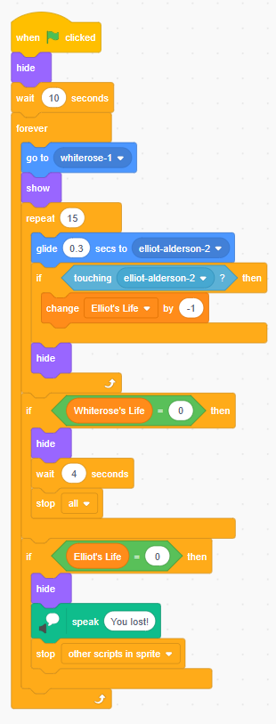
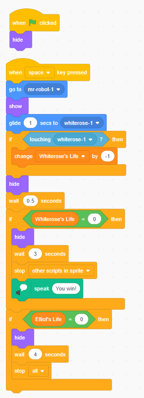

# Foundations of Programming: A Mr. Robot Battle Game

[🇧🇷 Versão em Português](#-versão-em-português) | [🇺🇸 English Version](#-english-version)

---

## 🇧🇷 Versão em Português

Um jogo de batalha inspirado na série **Mr. Robot**, desenvolvido inteiramente no **Scratch**.

### Como Jogar
O objetivo é derrotar a Whiterose usando o Mr. Robot e proteger Elliot Alderson.
1. Vá para a [Página do Projeto no Scratch](https://scratch.mit.edu/projects/1258039439)
2. Clique na **bandeira verde** para iniciar o jogo.
3. Pressione **ESPAÇO** para lançar a máscara da Fsociety e derrotar a Dark Army.

> **Nota:** O jogo está em inglês pois foi desenvolvido para avaliação em um curso americano, com atividade sobre os fundamentos e lógica de programação.

### Tecnologias Utilizadas
* **Scratch** (Block coding)
* **Pixel Art Assets** personalizados.

### Foco em lógica de programação 
* **Lógica de Cooldown:** Implementei uma trava para evitar o "spam" de ataques, garantindo que cada pressão da tecla resulte em apenas um disparo.
* **Sistema de Vida (HP):** Sistema de monitoramento que utiliza operadores lógicos para garantir o encerramento correto do jogo ao atingir o limite de dano.

  

---

## 🇺🇸 English Version

A 2D battle game inspired by the aesthetic and narrative of the TV series **Mr. Robot**. Developed as part of a computer science learning path, focusing on core programming concepts.

### How to Run
1. Go to the [Scratch Project Page](https://scratch.mit.edu/projects/1258039439)
2. Click the **Green Flag** to start the intro sequence.
3. Press **SPACE** to launch the Fsociety mask and defeat the Dark Army.

### Technical Overview
* **Project Type:** CS50 Harvard - Problem Set 0.
* **Core Concepts:** Event-driven loops, variable management (state), and collision detection.

### Design Decisions and Features

**1. Game Mechanics & Logic**
To solve the "attack spam" issue, I implemented a cooldown logic using a "wait until not key pressed" structure, ensuring each key press corresponds to exactly one tactical strike.

**2. State Management (Health Systems)**
The game monitors two primary variables: *Elliot's Life* and *Whiterose's Life*. I used a "less than one" operator instead of "equals zero" to prevent bugs where rapid damage might bypass the zero value, ensuring the game terminates correctly under all conditions.

**3. Visuals and Immersion**
* **Backdrops:** Created to mimic the Eldorado Arcade, providing a dark, neon-lit environment.
* **Sprites:** Custom pixel art for Elliot, Mr. Robot, Tyrell Wellick, and Whiterose to maintain a retro-hacker aesthetic.

  

---

## 👤 Autor / Author

Desenvolvido por [**Bruno P. Brito**](https://github.com/bpb-bruno) | Email: [contato@brunopbrito.com.br](mailto:contato@brunopbrito.com.br)
